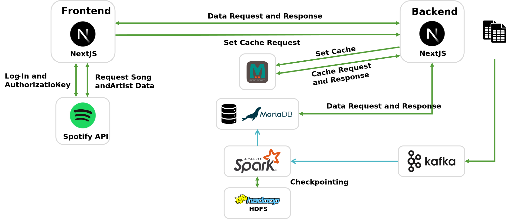

# DHBW Mannheim - Big Data
This repository contains the code for the project of the course Big Data at the DHBW Mannheim. The aim was to analyze the 
music streaming data of individuals.

## Contributor
- Yanick Bedel (8424886)
- Tjark Gerken (8692717)
- Carlo Rinderer (1902925)
- Niklas Seither (4253802)
- David Simon (1893552)


## Tech Stack
- [Kubernetes](https://kubernetes.io/)
- [NextJS](https://nextjs.org/)
- [MariaDB](https://mariadb.org/)
- [Memcached](https://memcached.org/)
- [Apache Spark (PySpark)](https://spark.apache.org/)


## Prerequisites

# TODO: Spotify App @Tjark

To run the project locally you need the following tools installed:
- [Docker](https://docs.docker.com/get-docker/)
- [Minikube](https://minikube.sigs.k8s.io/docs/start/)

Furthermore, you need a running Kubernetes cluster with both a Strimzi.io Kafka operator 
and a Hadoop cluster with YARN for checkpointing before you can deploy the app.

In the following we provide a step-by-step guide to set up the project locally.

```bash
A running Strimzi.io Kafka operator and a running Hadoop cluster with YARN (for checkpointing)

```bash
# Install Docker
## Add Docker's official GPG key:
sudo apt-get update
sudo apt-get install ca-certificates curl
sudo install -m 0755 -d /etc/apt/keyrings
sudo curl -fsSL https://download.docker.com/linux/ubuntu/gpg -o /etc/apt/keyrings/docker.asc
sudo chmod a+r /etc/apt/keyrings/docker.asc

## Add the repository to Apt sources:
echo \
  "deb [arch=$(dpkg --print-architecture) signed-by=/etc/apt/keyrings/docker.asc] https://download.docker.com/linux/ubuntu \
  $(. /etc/os-release && echo "$VERSION_CODENAME") stable" | \
  sudo tee /etc/apt/sources.list.d/docker.list > /dev/null
sudo apt-get update

## Install Docker
sudo apt-get install docker-ce docker-ce-cli containerd.io docker-buildx-plugin docker-compose-plugin

## Allow user to use docker as non-root
sudo groupadd docker
sudo usermod -aG docker $USER
newgrp docker
# INFO: maybe you need to reboot the system so changes take effect


# Install Minikube
curl -Lo minikube https://storage.googleapis.com/minikube/releases/latest/minikube-linux-amd64 \
  && chmod +x minikube

sudo cp minikube /usr/local/bin && rm minikube

minikube start --addons=ingress --cpus=4 --memory=8000


# Set up Kubernetes for big data project
## Kafka
helm repo add strimzi http://strimzi.io/charts/
helm install my-kafka-operator strimzi/strimzi-kafka-operator
kubectl apply -f https://raw.githubusercontent.com/strimzi/strimzi-kafka-operator/0.41.0/examples/kafka/kafka-ephemeral-single.yaml

## Hadoop
helm repo add pfisterer-hadoop \
    https://pfisterer.github.io/apache-hadoop-helm/

helm repo update 

helm status my-hadoop-cluster 2>&1 >>/dev/null 2>&1 || \
    helm install --wait --timeout 10m0s \
        my-hadoop-cluster pfisterer-hadoop/hadoop \
        --set hdfs.dataNode.replicas=3  \
        --set yarn.nodeManager.replicas=3


# Install NodeJS through Node Version Manager
curl -o- https://raw.githubusercontent.com/nvm-sh/nvm/v0.39.7/install.sh | bash
export NVM_DIR="$([ -z "${XDG_CONFIG_HOME-}" ] && printf %s "${HOME}/.nvm" || printf %s "${XDG_CONFIG_HOME}/nvm")"
[ -s "$NVM_DIR/nvm.sh" ] && \. "$NVM_DIR/nvm.sh"
nvm install v18.20.3

cd web-app
npm install 
npm run build

# Install Skaffold
curl -Lo skaffold https://storage.googleapis.com/skaffold/releases/latest/skaffold-linux-amd64 && \
sudo install skaffold /usr/local/bin/

skaffold dev
```


## Use Case Description

The application makes it possible to analyse individual user data from the Spotify Music streaming platform. 
The data from the last year of the respective user is requested and then analysed in order to present it in
an appealing way.

The background to this is to gain a deeper and more detailed insight into the user's taste in music and the 
associated consumer behaviour in order to be able to make even better decisions when selecting or searching for 
songs in the future and not to forget older treasures

Even though Spotify itself offers a similar function, it is not sufficient in that it is only created for the user once
at the end of each year.

With this application we would like to provide the following analyses:
- Favourite song (longest aggregated playing time of the song over the period)
- Favourite artist (longest aggregated playing time of the songs of an artist over the period)
- Total streaming time (summed playing time of all songs over the period)

These functions are supplemented with the matching title images and audio samples of the songs as well as the 
profile picture of the artists in order to offer the genuine Spotify experience and maintain the recognition value.


## System Architecture

### Overview
The system includes a frontend application developed with NextJS and a backend application, also based on NextJS, which 
handles central control and data processing. Users log into the web app with their Spotify accounts to access detailed 
analyses. This authentication is done through the Spotify API, which is also used to provide album covers, song previews,
and artist profile pictures.

Data processing is handled by Apache Spark (PySpark). Spark extracts data from a Kafka topic, transforms it, and loads 
the aggregated results into a MariaDB database. Spark uses watermarking to ensure the processing of late-arriving data 
and stores checkpoints in Hadoop HDFS to maintain data consistency and recoverability.

The data stored in MariaDB is retrieved by the backend application and cached via Memcached to optimize performance. 
The entire data pipeline follows an ETL (Extract, Transform, Load) approach, where data is continuously extracted, 
transformed, and loaded into the database.

The data flow begins with the Kafka component, which acts as the data ingestion layer. Spark processes this data in
real-time and stores it in the database. The results are then retrieved by the backend application and passed to the 
frontend application, where they are presented to the users.




Each of the components is described in more detail within the following sections.

### Components
#### Kafka (Data Ingestion)
Kafka serves as a message queue system, enabling live data streaming. In this architecture, Kafka is used to capture the
song play activities requested by the publisher, the NextJS App, and forwards the data to Spark which is acting as the subscriber for processing the Spotify data to the applications needs. The topic is defined by the [kafka-topic.yaml](k8s/kafka-topic.yaml).

#### Spark (Batch + Stream Processing)
The Spark application is designed to process and analyse streaming data from a Kafka topic, simulating song play
activities. The processed results are then stored in a MariaDB database. The application follows an ETL 
(Extract, Transform, Load) pipeline which is defined in the [spark-app.py](spark-app/spark-app.py):

First, it extracts data from a Kafka topic named `spotify-track-data`. This data includes details about song plays, such
as the user id, artist name, track name and milliseconds played. The data is then transformed by parsing the JSON messages
and adding timestamps to facilitate time-based operations. Late-arriving data is handled through watermarking, ensuring 
the application process out-of-order events effectively.

Next, the data is aggregated to compute key metrics with functions defined in the [spark-app.py](spark-app/spark-app.py), such as total playtime over all songs with the fucntion `totalPlaytime`, the total playtime for each artist with the functions `topArtist` and the total playtime for each song with the function `topSongs`. The results are then loaded into corresponding tables in the [MariaDB](k8s/mariadb.yaml) beeing `total_playtime`, `top_artists` and `top_songs`. Continuous streaming queries are used to process data live with checkpoints (saved in the hadoop cluster) ensuring data consistency and recovery from potential failures.

#### MariaDB (Serving Layer)
[MariaDB](k8s/mariadb.yaml) is used as a relational database where the aggregated results from Spark are stored to enable their retrieval by the backend [NextJS](web-app/). It therefore acts as the serving layer of the application. The [tables of the database schema](k8s/mariadb.yaml) are taylored to the minimum columns required for identification and to display the desired information. 

The table `top_songs` has the columns `UID`, `trackName`, `artistName` and `total_msPlayed`. The first three are strings (type Varchar) and the last one is an integer, all of which must not be null. The `UID` and `track_name`serve as the primary key.

The table `top_artists` has the columns `UID`, `artistName` and `total_msPlayed`. The first two are strings (type Varchar) and the last one is an integer, all of which must not be null. The `UID` and `artist_name` serve as the primary key.

The table `total_playtime` has the columns `UID` and `total_msPlayed`. The first one is a string (type Varchar) and the last one is an integer, all of which must not be null. The UID serves as the primary key.


#### Memcached
[Memcached](k8s/memcached.yaml) is a in memory cache which safes the data that has been requested and displayed by the Web-App to reduce retrieval latency and processing ressources when the same data is requested again. It is stored in a key-value fashion, the key being the selected person's `UID` and the value being a JSON storing the associated information, by appending it to the cache pushing out older data if the cache memory is full using timestamps from the moment a piece of data was last requested. Data older than ten minutes will be purged from the cache automaticaly. This is defined by the [setCache-function](web-app/src/app/api/set-cache/route.ts).

#### NextJS Frontend
The frontend application, developed with [NextJS](web-app/), provides the user interface through which users can access the analyses.
It communicates with the backend application to retrieve and display the necessary data. The frontend part of the [NextJS](web-app/) app is used as the UI which allows the user to [log into their Spotify account](web-app/src/app/_components/spotifyAuthorization.tsx) for authorization purposes using the `SpotifyAuthorization` function and to [send the token](web-app/src/app/api/auth-request/route.ts) recieved doing that again to Spotify to gain an authorization token using the `authOptions` function as well as start the [data retrieval request](web-app/src/app/results/page.tsx) using the `useEffect` function to the [NextJS](web-app/) backend. It also serves the purpose of [sending the request for caching](web-app/src/app/api/set-cache/route.ts).

#### NextJS Backend
The backend application, also developed with [NextJS](web-app/), serves as the central control and data processing layer. It checks whether the requested data already is in the [Memcached](k8s/memcached.yaml) retrieves it from the [MariaDB](k8s/mariadb.yaml) if that's not the case and provides it to the frontend application either all with the [`useEffect` function](web-app/src/app/results/page.tsx). The backend application also handles the [fetching process for the cosmetic artist data](web-app/src/app/api/get-artist-data/route.ts) as well as the [cosmetic song data](web-app/src/app/api/get-track-data/route.ts) with the Spotify API. It therefore handles all request that require transactions between the Web App UI and the data processing part of the application hiding all system related information from the user to increase security.

#### Spotify API
The Spotify API is used for authentication as well as the retrieval of album covers and artist profile pictures.
Users log into the web app with their Spotify accounts in the Web App to access the analyses. Authentication is carried out via an OAuth flow, where users grant the application access to their account data by logging in. However, the actual data used for the analyses is not retrieved from the Spotify API due to restricted data access (more on this in the "Challenges" section).

The Spotify API is used for the following functions:
- Registering the application to obtain the Client ID and Client Secret
- Sending a request to the Spotify endpoint with parameters such as client_id, response_type, redirect_uri, scope, and state
- User login with their Spotify account granting access to account data.
- Redirecting to the web app
- Sending the authorization code to Spotify to obtain the access token, which needs to be refreshed every hour and is send to the backend when recieved
- Sending song/artist name to the respective endpoint to fetch song covers, artist profile pictures and infromation, genres using the access token

This detailed description of the system architecture and its individual components provides an overview 
of the entire system and the interactions of various technologies. A more comprehensive display of the Spotify API's functionality can be found in the figure below.


##### Authorization

To make the application work the user has to go through an authorization process with Spotify. This step is necesarry for the user to be able to select data he wants to analyse and therefore to access the features of the application as well as for the application to be able to fetch complementary and cosmetical data. For that case Spotify provides their own log in page to which the user is directed. After logging in with the users credentials successfully the application sends a request for access and as well as a token to Spotify in order to recieve a authentification token which is later used by the backend to make the requests for the cosmtical data.   
 
### Data Model


## Learnings

- Ensuring the functionality of individual components is way easier than keeping up a stable and functional conection between them
- The biggest issues won't always come from the parts of the project that can be directly associated with the components of the application

## Challenges

# Spotify API:

Initially, we pursued the idea of using the Spotify API to query the data of individual users in real time via the authentication of the Spotify user account in order to subsequently stream this data into the system, to enable the use of the application by anyone with a Spotify account and to ensure the maximum timeliness of the data and thus analyses.

However, the limitations of the Spotify API in terms of the scope of the queryable history to the last 50 items has frustrated this plan. We initially tried to query a chain of requests with a scope of 50 elements each for dynamically defined periods of time by specifying a timestamp, which makes it possible to query the elements after this point in time, but this function is also strictly limited to the last 50 elements and thus does not offer a real "big data" scenario.

We therefore made use of Spotify's obligation to provide the user's streaming information to them. By requesting our groupmembers last years history we can offer the option to select the data set to be analyzed in the Web App dropdown menu.

# MongoDB to MariaDB:

Another change of plans occured when we first planned to use a non relational Database in MongoDB thinking that a Database without a strict schema will make the storage of different data easier to handle. But after having troubles replacing the MongoDB with the initially predefined MariaDB and recieving the data from spotify now knowing the data strcuture and the attributes we need for our analyses we decided that using a MariaDB makes more sense for our very straight forward data structure also ensuring further type security.

# Setup and configuration issues:

While persuing the project we encountered multiple issues related to the application setup as well as hardware ressource induced compications.

One of them beeing the task to get the system to run on all groupmembers laptops having to make addoptions to the different opperation system by for example changing the the exit sequences of the yaml-files in the k8s folder from "CLRF" used on Apple devices to "LF" used by Windows devices.

Also not all of the devices are private devices and therefore don't offer full access to configurations enforcing the use of virtual machines and other techniques which add further obstacles in the fight for the very limited hardware ressources.

Limited hardware ressources, espacially RAM, was a big issue in general which got even more severe as the project continued to grow and therefore required more and more ressources to the point where heavy configurations had to be made to even enable the full functionality of the application. These shortages made the development process increasingly slow because changes to the live application often ends in a rebuild sequence or a new start through skaffold dev which takes a lot of time when all the ressources are caught up in maintaining the system.

Keeping up all the components and ensuring their stable functionality was another setup related issue since topics won't always start when the assigned ressources are not enough, the kubernetes cluster might crash, spark can't build a conection to the database or fetching data ends in a runtime error because either Kafka crashed or the available ressources arn't enough to process and analyse the data with spark quickly enough.

A functional challenge was the "communication" between NextJS and Spark so that the Backend knows when Spark has finished the processing completely and the final data lays in the MariaDB because displying the content to early would falsify the analyses. We ensured this by implementing a check sequence where when NextJS fetched the same data five times in a row we can conclude that Spark finished its processing and the data in the MariaDB is final.

Another issue was related to the funcionality of the DNS. Sometimes we encountered the problem that minikube couldn't reach the container registery and therefore couldn't download and build the necessary images. At different times the containers couldn't reach the Spotify API also blocking the performance of the application.

## Deploy

To develop using [Skaffold](https://skaffold.dev/), use `skaffold dev`. 
